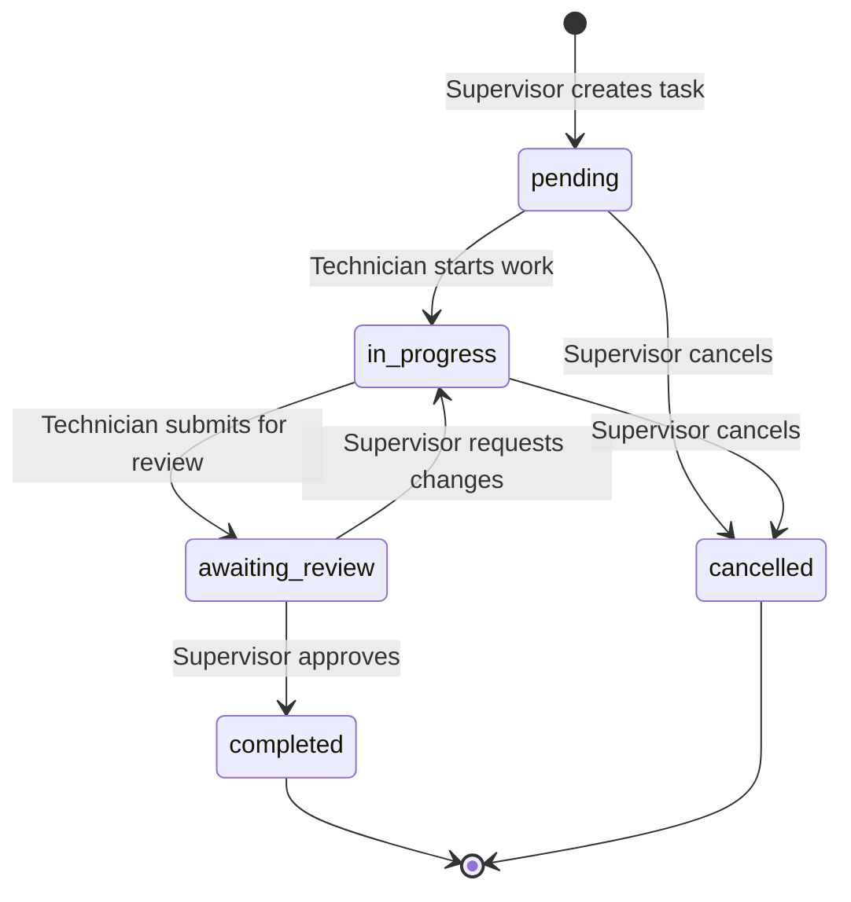

# Role-Based Task Workflow Design Document

## Overview

This design implements a strict role-based workflow for task management where Supervisors have full control over task creation, assignment, and completion, while Technicians have limited permissions focused on executing assigned work and providing feedback. The system enforces these permissions at both the UI and database levels.

## Architecture

### Role Permission Matrix

| Action | Supervisor | Technician |
|--------|-----------|-----------|
| Create Task | ✅ | ❌ |
| View All Tasks | ✅ | ❌ |
| View Assigned Tasks | ✅ | ✅ |
| Edit Task Details | ✅ | ❌ |
| Assign/Reassign Task | ✅ | ❌ |
| Update Status (pending → in_progress) | ✅ | ✅ |
| Update Status (in_progress → awaiting_review) | ✅ | ✅ |
| Update Status (awaiting_review → completed) | ✅ | ❌ |
| Update Status (any → cancelled) | ✅ | ❌ |
| Add Comments/Feedback | ✅ | ✅ |
| Upload Files | ✅ | ✅ |
| Delete Task | ✅ | ❌ |

### Task Status Flow



## Components and Interfaces

### 1. Role-Based Task List Component

**File**: `components/tasks/role-based-task-list.tsx`

**Purpose**: Display tasks based on user role with appropriate filters and actions

**Supervisor View Features**:
- Display all tasks in the system
- "Create Task" button prominently displayed
- Filters: Status, Priority, Assigned To, Date Range
- Bulk actions: Reassign, Update Priority
- Task statistics dashboard

**Technician View Features**:
- Display only assigned tasks
- No "Create Task" button
- Filters: Status, Priority, Due Date
- Quick status update actions
- My Tasks counter

**Shadcn Components**: `DataTable`, `Button`, `Select`, `Badge`, `Tabs`

**Implementation**:
```typescript
interface TaskListProps {
  userRole: 'supervisor' | 'technician';
  userId: string;
}

// Conditional rendering based on role
// Supervisors see all tasks, Technicians see filtered tasks
```

### 2. Task Creation Form (Supervisor Only)

**File**: `components/tasks/supervisor-task-form.tsx`

**Purpose**: Allow Supervisors to create and assign tasks

**Features**:
- All task fields editable
- Technician selection dropdown (filtered by active status)
- Priority and due date selection
- Location field with autocomplete
- File attachment during creation

**Validation**:
- Title required (max 255 characters)
- Assigned technician required
- Due date must be in the future
- Priority must be selected

**Shadcn Components**: `Dialog`, `Form`, `Input`, `Textarea`, `Select`, `Calendar`, `Button`

### 3. Task Detail View (Role-Aware)

**File**: `components/tasks/task-detail-view.tsx`

**Purpose**: Display task details with role-appropriate actions

**Supervisor View**:
- Edit button for all fields
- Reassign button
- Status dropdown (all statuses available)
- Delete task button
- Full comment history
- Review section for awaiting_review tasks

**Technician View**:
- Read-only task details
- Status update buttons (limited to allowed transitions)
- Add feedback section
- File upload section
- Comment history (read-only for Supervisor comments)

**Shadcn Components**: `Card`, `Badge`, `Button`, `Textarea`, `Select`, `Separator`, `ScrollArea`

### 4. Feedback and Comment System

**File**: `components/tasks/task-feedback.tsx`

**Purpose**: Allow Technicians to provide work updates and Supervisors to respond

**Features**:
- Threaded comments
- File attachments per comment
- Timestamp and author display
- Role badges (Supervisor/Technician)
- Edit/delete own comments (within time limit)

**Comment Types**:
- Status updates (auto-generated)
- User comments
- System notifications (assignment changes)

**Shadcn Components**: `Card`, `Avatar`, `Badge`, `Textarea`, `Button`

### 5. Task Review Interface (Supervisor Only)

**File**: `components/tasks/task-review-panel.tsx`

**Purpose**: Dedicated interface for Supervisors to review completed work

**Features**:
- Display all Technician feedback chronologically
- Show all uploaded files with preview
- Approve button (sets status to completed)
- Request changes button (returns to in_progress with comment)
- Quality checklist (optional)

**Workflow**:
1. Supervisor receives notification
2. Opens review panel
3. Reviews feedback and files
4. Either approves or requests changes
5. Technician receives notification of decision

**Shadcn Components**: `Sheet`, `Card`, `Button`, `Textarea`, `Checkbox`, `ScrollArea`

### 6. Notification System

**File**: `components/notifications/task-notifications.tsx`

**Purpose**: Real-time notifications for task events

**Notification Types**:

**For Technicians**:
- New task assigned
- Task reassigned to you
- Supervisor added comment
- Task returned for changes
- Task cancelled

**For Supervisors**:
- Task status changed to awaiting_review
- Technician added comment
- Task overdue alert

**Implementation**:
- Supabase real-time subscriptions
- Toast notifications for immediate alerts
- Notification bell with unread count
- Notification history panel

**Shadcn Components**: `Toast`, `Popover`, `Badge`, `ScrollArea`, `Button`

### 7. Task Assignment Selector

**File**: `components/tasks/technician-selector.tsx`

**Purpose**: Dropdown for selecting Technicians during task creation/reassignment

**Features**:
- Filter by active Technicians only
- Display Technician name and current workload
- Search functionality
- Show availability status (if implemented)

**Data Display**:
- Technician name
- Current task count
- Role badge
- Avatar

**Shadcn Components**: `Select`, `Command`, `Avatar`, `Badge`

## Data Models

### Updated Task Status Enum

```typescript
type TaskStatus = 
  | 'pending'        // Initial state after creation
  | 'in_progress'    // Technician is working
  | 'awaiting_review' // Technician submitted for review
  | 'completed'      // Supervisor approved
  | 'cancelled';     // Supervisor cancelled
```

### Task Comment Model

```typescript
interface TaskComment {
  id: string;
  task_id: string;
  author_id: string;
  author_role: 'supervisor' | 'technician';
  content: string;
  comment_type: 'user_comment' | 'status_update' | 'system_notification';
  created_at: string;
  updated_at: string;
  author?: Profile;
  attachments?: FileRecord[];
}
```

### Task History Model

```typescript
interface TaskHistory {
  id: string;
  task_id: string;
  changed_by: string;
  change_type: 'created' | 'assigned' | 'reassigned' | 'status_changed' | 'edited';
  old_value?: any;
  new_value?: any;
  created_at: string;
}
```

## Database Schema Updates

### Add awaiting_review Status

```sql
-- Update service_tasks table status check constraint
ALTER TABLE service_tasks 
DROP CONSTRAINT IF EXISTS service_tasks_status_check;

ALTER TABLE service_tasks 
ADD CONSTRAINT service_tasks_status_check 
CHECK (status IN ('pending', 'in_progress', 'awaiting_review', 'completed', 'cancelled'));
```

### Create Task History Table

```sql
CREATE TABLE task_history (
  id UUID PRIMARY KEY DEFAULT gen_random_uuid(),
  task_id UUID REFERENCES service_tasks(id) ON DELETE CASCADE,
  changed_by UUID REFERENCES profiles(id) NOT NULL,
  change_type TEXT CHECK (change_type IN ('created', 'assigned', 'reassigned', 'status_changed', 'edited')),
  old_value JSONB,
  new_value JSONB,
  created_at TIMESTAMP WITH TIME ZONE DEFAULT NOW()
);

CREATE INDEX idx_task_history_task_id ON task_history(task_id);
CREATE INDEX idx_task_history_created_at ON task_history(created_at DESC);
```

### Update Task Comments Table

```sql
ALTER TABLE task_comments 
ADD COLUMN author_role TEXT CHECK (author_role IN ('supervisor', 'technician', 'admin'));

ALTER TABLE task_comments 
ADD COLUMN comment_type TEXT CHECK (comment_type IN ('user_comment', 'status_update', 'system_notification')) DEFAULT 'user_comment';

CREATE INDEX idx_task_comments_task_id ON task_comments(task_id);
```

## Row Level Security (RLS) Policies

### Task Visibility Policies

```sql
-- Supervisors can see all tasks
CREATE POLICY "Supervisors can view all tasks"
ON service_tasks FOR SELECT
TO authenticated
USING (
  EXISTS (
    SELECT 1 FROM profiles
    WHERE profiles.id = auth.uid()
    AND profiles.role IN ('supervisor', 'admin')
  )
);

-- Technicians can only see assigned tasks
CREATE POLICY "Technicians can view assigned tasks"
ON service_tasks FOR SELECT
TO authenticated
USING (
  assigned_to = auth.uid()
  AND EXISTS (
    SELECT 1 FROM profiles
    WHERE profiles.id = auth.uid()
    AND profiles.role = 'technician'
  )
);
```

### Task Creation Policies

```sql
-- Only Supervisors can create tasks
CREATE POLICY "Supervisors can create tasks"
ON service_tasks FOR INSERT
TO authenticated
WITH CHECK (
  EXISTS (
    SELECT 1 FROM profiles
    WHERE profiles.id = auth.uid()
    AND profiles.role IN ('supervisor', 'admin')
  )
);
```

### Task Update Policies

```sql
-- Supervisors can update any field
CREATE POLICY "Supervisors can update all task fields"
ON service_tasks FOR UPDATE
TO authenticated
USING (
  EXISTS (
    SELECT 1 FROM profiles
    WHERE profiles.id = auth.uid()
    AND profiles.role IN ('supervisor', 'admin')
  )
);

-- Technicians can only update status and specific fields
CREATE POLICY "Technicians can update assigned task status"
ON service_tasks FOR UPDATE
TO authenticated
USING (
  assigned_to = auth.uid()
  AND EXISTS (
    SELECT 1 FROM profiles
    WHERE profiles.id = auth.uid()
    AND profiles.role = 'technician'
  )
)
WITH CHECK (
  -- Technicians can only change status, not other fields
  assigned_to = auth.uid()
  AND status IN ('in_progress', 'awaiting_review')
);
```

## API Routes

### 1. Task Creation API

**Route**: `app/api/tasks/route.ts` (POST)

**Authorization**: Supervisor only

**Request Body**:
```typescript
{
  title: string;
  description?: string;
  priority: 'low' | 'medium' | 'high' | 'urgent';
  assigned_to: string; // Technician UUID
  due_date?: string;
  location?: string;
}
```

**Response**: Created task object

**Side Effects**:
- Create task history entry
- Send notification to assigned Technician

### 2. Task Status Update API

**Route**: `app/api/tasks/[id]/status/route.ts` (PATCH)

**Authorization**: Role-based validation

**Request Body**:
```typescript
{
  status: TaskStatus;
  comment?: string;
}
```

**Validation**:
- Technicians can only set: in_progress, awaiting_review
- Supervisors can set any status
- Validate status transitions

**Side Effects**:
- Create task history entry
- Create status update comment
- Send notification to relevant users

### 3. Task Review API

**Route**: `app/api/tasks/[id]/review/route.ts` (POST)

**Authorization**: Supervisor only

**Request Body**:
```typescript
{
  action: 'approve' | 'request_changes';
  comment: string;
}
```

**Actions**:
- approve: Set status to completed
- request_changes: Set status to in_progress, add comment

**Side Effects**:
- Create task history entry
- Send notification to Technician

### 4. Task Reassignment API

**Route**: `app/api/tasks/[id]/reassign/route.ts` (PATCH)

**Authorization**: Supervisor only

**Request Body**:
```typescript
{
  new_assignee_id: string;
  reason?: string;
}
```

**Side Effects**:
- Update assigned_to field
- Create task history entry
- Notify previous and new Technicians

## Error Handling

### Permission Errors

**Scenario**: Technician attempts to create task

**Response**: 403 Forbidden

**UI Behavior**: Hide create button, show toast if API called directly

### Invalid Status Transition

**Scenario**: Technician tries to set status to completed

**Response**: 400 Bad Request with error message

**UI Behavior**: Disable invalid status options in dropdown

### Assignment Validation

**Scenario**: Assign task to inactive user

**Response**: 400 Bad Request

**UI Behavior**: Filter inactive users from selector

## Testing Strategy

### Unit Tests

1. **Role Permission Tests**
   - Test Supervisor can access all features
   - Test Technician restrictions
   - Test status transition validation

2. **Component Tests**
   - Test task list filtering by role
   - Test form validation
   - Test notification rendering

### Integration Tests

1. **Workflow Tests**
   - Complete task lifecycle from creation to completion
   - Test reassignment workflow
   - Test review and approval process

2. **RLS Policy Tests**
   - Verify Technicians can't see other tasks
   - Verify Supervisors can see all tasks
   - Test update permissions

### E2E Tests

1. **Supervisor Workflow**
   - Create task → Assign → Review → Approve

2. **Technician Workflow**
   - Receive task → Start work → Add feedback → Submit for review

3. **Notification Flow**
   - Verify all notification triggers
   - Test real-time updates

## Performance Considerations

### Database Optimization

- Index on assigned_to for Technician queries
- Index on status for filtering
- Index on created_at for sorting

### Real-time Subscriptions

- Subscribe only to relevant tasks based on role
- Unsubscribe when component unmounts
- Debounce notification updates

### Caching Strategy

- Cache Technician list for assignment selector
- Cache user role in context
- Invalidate task list on updates
